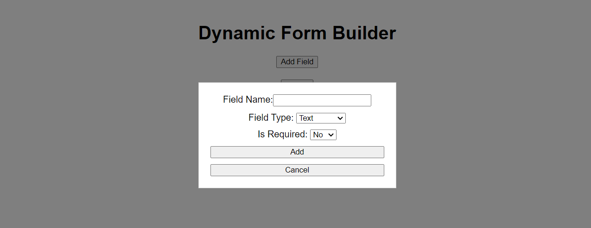
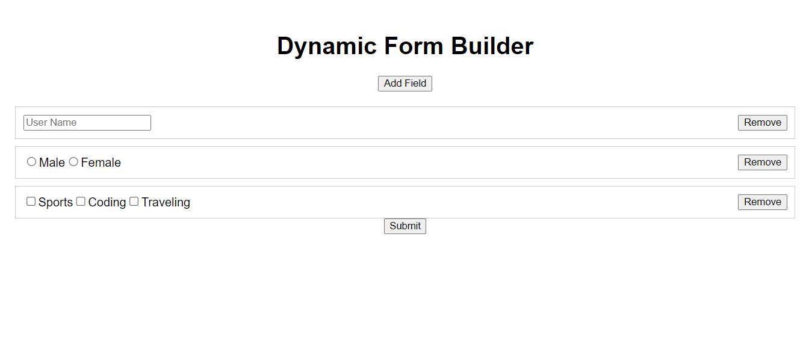
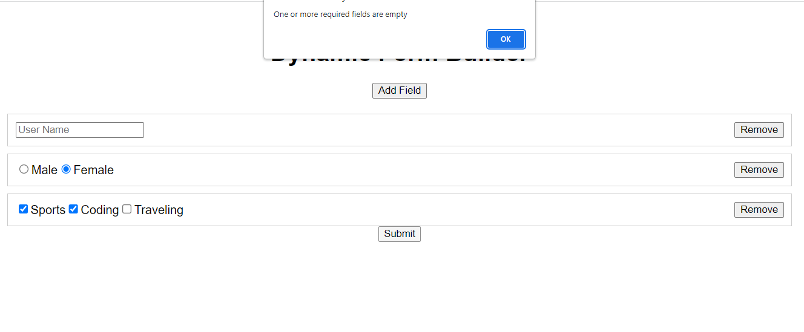
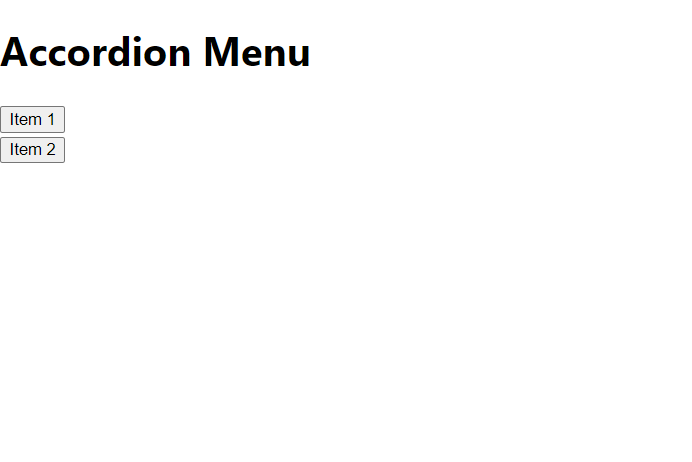
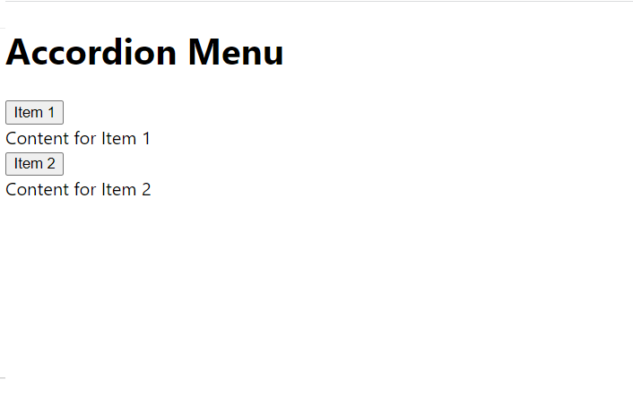

# Capermint_Task
# Practical 1 :
Create dynamic form builder in react.js 

### Built with
- React Js

## Screenshot

# Practical 2 : 
Build Accordian menu in react.js without using any external libraries

### Built with
- React Js

## Screenshot

